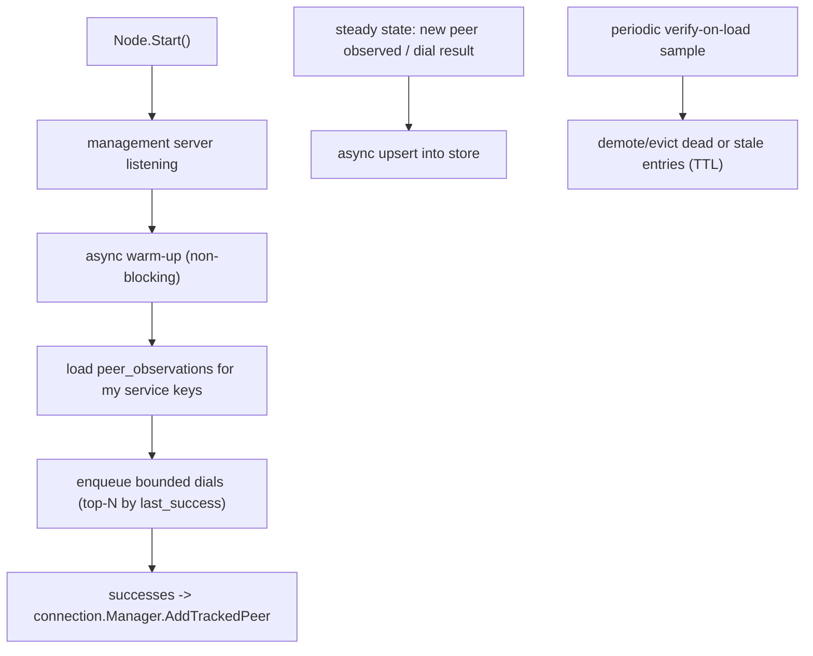
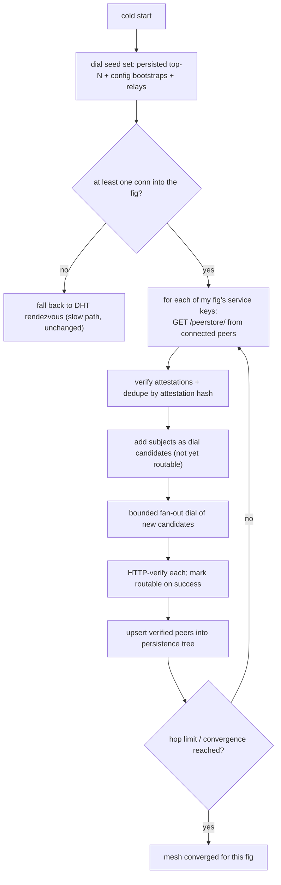

# Connection Persistence Tree (design)

Status: proposal / not yet implemented.

## Problem

Banyan nodes today keep all peer-tracking state in memory. Two consequences:

1. **Nothing survives a restart.** When a node restarts it has an empty
   connection table and an empty (or cold) libp2p peerstore, so it has to
   rediscover every peer from scratch via the DHT rendezvous.
2. **Discovery through symmetric NAT is slow/unreliable.** When every node sits
   behind a consumer VPN (e.g. the Mullvad test cluster), DCUtR hole-punching
   cannot establish direct connections, so everything falls back to Circuit
   Relay v2. Passive gossipsub/DHT rendezvous then takes a long time to surface
   peers, and in practice we have been forcing connections by hand with
   `POST /network/connect/<peerID>` to make the chat service converge.

The idea: maintain a **durable, fig- and service-key-scoped tree of connection
items** that (a) is reloaded on startup to warm-dial known-good peers, and (b)
can be shared between nodes so a node can learn reachable peers for a service
without waiting on global rendezvous.

## What already exists (building blocks)

- **`types.ConnectionItem`** — per-peer record: peer ID, alias, `ServiceKeys
  [][]byte`, connection timestamps, last-disconnect, HTTP-capability flags, and a
  free-form `data map[string]interface{}`. See
  [apps/node/types/types.go](../types/types.go) (`ConnectionItem`, ~line 262).
  This is essentially the row the tree would persist.
- **`types.PeerOptions`** with origin-tagged constructors —
  `NewManualPeerOptions`, `NewServicePeerOptions`, `NewBackgroundPeerOptions`,
  `NewGossipPeerOptions`. `ConnectionType` is already a first-class field, so a
  persisted item carries provenance (operator-pinned vs organically discovered
  vs imported from a peer).
- **`connection.Manager.AddTrackedPeer`** — the in-memory write path, indexed by
  peer ID and tagged with service keys. See
  [apps/node/connection/manager.go](../connection/manager.go) (~line 78). The
  dial path `ConnectToPeer` (~line 325) does DHT `FindPeer` then `host.Connect`.
- **libp2p peerstore** — the host already stores multiaddrs and protocol records
  for known peers. go-libp2p ships `pstoreds`, a datastore-backed peerstore that
  persists this to disk for free. It does **not** slice by service key/fig or
  carry custom verification metadata.
- **`/network/peers/all`** — already exposes the in-memory snapshot.
- **Fig structures** — figs are a signed tree of `path -> serviceKeys` with
  `requiredSigners`. See `FigFile` in
  [apps/topology-gen/generator.go](../../topology-gen/generator.go) and the fig
  handling in [apps/node/libp2p-http/handler.go](../libp2p-http/handler.go).

So the gap is three things: (1) serialize/restore `ConnectionItem` + selected
multiaddrs, (2) a fig/service-key grouping layer, (3) endpoints for
save/load and peer-to-peer share.

## Data model

Persist two layers per peer, because they have very different cost and
trust characteristics:

- **Address book (cheap, dial-oriented):**
  `{ peerID, multiaddrs[], lastSeenAt, lastSuccessAt, source }`. Enough to
  attempt a dial on cold start. Multiaddrs include circuit-relay addresses,
  which is how a NAT-stuck peer advertises reachability.
- **Verified facts (richer, optional):** HTTP-capable / bidirectional-HTTP
  flags, transport history, observed RTT. Useful for ranking but most likely to
  drift between nodes, so it is never trusted from an import without
  re-verification.

### Keying: service key vs fig

A peer can be authoritative for multiple service keys at multiple subpaths of a
fig. Two shapes were considered:

- **By service key (flat)** — "peers I've seen advertise key K". Simpler, and it
  composes cleanly because figs are *already* built out of service keys: a
  per-fig view is computed on demand by unioning the entries for each key in the
  loaded fig tree.
- **By fig (nested)** — mirrors the fig tree exactly, peers attach at the
  deepest node where they're authoritative.

**Decision: store flat, keyed by service key hex; compute the per-fig view on
demand from the loaded fig.** The service-key hex is the same identifier used in
routing (`fmt.Sprintf("%x", crypto.MarshalPublicKey(pub))`) and in
`/router/<serviceKeyHex>/...`, so it lines up end-to-end.

### Storage

A small SQLite table under the existing per-node data dir (chat-service already
uses `/app/data`):

```sql
CREATE TABLE peer_observations (
  service_key  TEXT NOT NULL,   -- hex of marshalled service public key
  peer_id      TEXT NOT NULL,
  multiaddr    TEXT NOT NULL,
  source       TEXT NOT NULL,   -- manual | service | gossip | imported
  last_seen    INTEGER NOT NULL,
  last_success INTEGER,         -- last successful dial (NULL if never)
  attestation  BLOB,            -- optional signed claim (see sharing)
  PRIMARY KEY (service_key, peer_id, multiaddr)
);
CREATE INDEX idx_peer_obs_key ON peer_observations(service_key, last_success);
```

A JSON/CBOR file works for tiny clusters but loses indexed lookup and atomic
writes, so SQLite is preferred.

## Lifecycle



Key rules:

- **Never block startup on disk or dials.** Warm-up runs after the management
  server is already listening; dials are rate-limited so a node doesn't
  self-DDoS on a large table.
- **TTL + bounded cap per service key.** Entries with no successful dial for N
  days are dropped; each service key keeps at most M best entries. This matters
  because the topology generator currently rotates *all* identities on every
  regen, so pre-regen entries become permanent garbage without a TTL.
- **Verify-on-load.** Periodically sample saved peers, dial, and demote the dead
  ones rather than trusting `last_success` forever.

## What NOT to persist

- Auth tokens, signing private keys, anything that would leak credentials on
  export.
- Aliases (the 4-char shorthands) — display-only and node-local; they re-hash on
  load.
- In-memory handles (mutexes, channels).

## Sharing between nodes (operator/local layer)

Two management endpoints on the existing HTTP management API:

- `GET /peers/persisted?fig=<alias>` (or `?serviceKey=<hex>`) — dump the
  persisted peer set for a fig/key. **Localhost-only** by default, matching the
  pattern used by `/node/shutdown` and `/network/peers/all`.
- `POST /peers/persisted` — body is a list of (optionally attested) entries;
  validate and merge.

This covers operator-assisted seeding (export from one node, import into
another) without any new transport. The peer-to-peer automated version is the
"logical conclusion" below.

## Trust and anti-poisoning (applies to all import paths)

A naive import is a poisoning and privacy vector:

- A malicious peer can hand over a sybil swarm tagged with a key it doesn't
  serve, biasing all future dials toward attacker-controlled relays.
- An exporter leaks its address book (a correlation/social-graph leak).

Defenses, in increasing strictness (layer as needed):

1. **Localhost-only export** for operator seeding.
2. **Signed attestations.** Each shared entry carries
   `attestation = sign_P( {observer: P, subject: Q, serviceKey: K, addrs, observedAt} )`
   where `P` is the observing peer (libp2p identity) or a fig `requiredSigner`.
   Imports verify the signature and that `P` is authorized for the fig.
3. **Verify-before-trust.** An imported entry is only used for *routing* after
   this node has itself successfully dialed and HTTP-verified the subject; until
   then it is a dial candidate only.
4. **Membership-gated sharing.** A responder only serves entries for a service
   key to a requester that proves membership in the fig (challenge: requester
   signs a nonce with a key in the fig tree).
5. **Caps + rate limits.** Bounded entries per response, prefer subjects with
   multiple independent attestations.

Recommended starting point: localhost export + signed attestations +
verify-before-trust. Add membership-gating and the pull protocol once the
in-process store is solid.

---

# Logical conclusion: peer-bootstrapping the tree over the libp2p HTTP API

The persistence tree above is node-local plus an operator-driven share. The
natural extension is to let nodes **populate each other's trees automatically
over the connection they already have**, turning the manual
`POST /network/connect/<peerID>` dance into self-healing, fig-scoped peer
exchange (PEX).

This directly addresses the slow-discovery problem: once a node has *one* live
connection into a fig (a seed, a relay, or a single persisted peer), it can pull
that peer's verified peer set for the fig's service keys and bootstrap the rest
of the mesh without waiting on global DHT rendezvous.

## The new endpoint

Banyan already serves an HTTP mux *over libp2p* on the `/http-proxy/1.0.0`
protocol — see [apps/node/libp2p-http/handler.go](../libp2p-http/handler.go)
(`/ping`, `/router/`, `/discovery/response`, `/services/figs`,
`/services/fig/`, registered ~lines 113-123). Add one peer-facing route there:

```
GET /peerstore/<serviceKeyHex>
```

served by a new `HandlePeerstoreQuery`, returning the attested entries this
responder has itself verified for that service key:

```json
{
  "serviceKey": "080112200087c944...",
  "entries": [
    {
      "subject": "12D3KooWNiT6...",
      "addrs": ["/ip4/.../p2p-circuit/p2p/12D3KooW..."],
      "observedAt": 1714000000,
      "attestation": {
        "observer": "12D3KooWResponder...",
        "sig": "base64..."
      }
    }
  ],
  "ttl": 3600
}
```

Because it rides the existing libp2p HTTP transport, it inherits the same
relay/hole-punched path used for `/router/` traffic — no new transport, ports,
or NAT assumptions.

## Bootstrap flow



This is epidemic/gossip convergence: each successful pull widens the candidate
set, each verified dial both makes a peer routable *and* enriches the tree that
this node will itself serve to the next caller. Seeded from a single connection,
a fig's participants discover each other in O(log N) rounds instead of waiting
on rendezvous tickers.

## Safety properties (carried over and tightened)

- **Responder serves only verified subjects.** A node only returns entries it has
  itself HTTP-verified for that key, so it cannot relay arbitrary sybils it
  merely heard about. Unverified hearsay is never re-shared.
- **Importer verifies before routing.** Pulled entries are dial candidates until
  this node independently dials + HTTP-verifies them (see "verify-before-trust").
  A poisoned response can at worst waste a bounded number of dial attempts.
- **Membership-gated pulls.** `GET /peerstore/<keyHex>` may require the caller to
  prove fig membership (sign a nonce with a key in the fig) before the responder
  shares its set — keeps the address book within co-fig participants and limits
  the correlation leak.
- **Loop / amplification control.** Hop limit per bootstrap round, dedupe by
  attestation hash, per-peer response caps, and rate limits. A node never
  forwards an entry it hasn't verified, so amplification is naturally bounded.
- **TTL everywhere.** Responses carry a TTL; entries expire, so rotated/dead
  identities (e.g. after a topology regen) drain out instead of propagating
  forever.

## Relationship to what we do by hand today

The manual bootstrap we run against the Mullvad cluster —
`POST /network/connect/<peerID>` for each service node, then watching
`/services/locators` populate — is exactly the flow above done by a human. This
feature automates it: seed one connection (or load one from the persisted tree
on restart), and the node pulls + verifies the rest of the fig's peers on its
own. Slow symmetric-NAT discovery stops being a blocker because peer reachability
is exchanged directly between fig participants rather than rediscovered globally.

## Suggested implementation order

1. In-process persistence tree (SQLite store + warm-up dials + TTL/eviction).
   Pairs well with enabling libp2p `pstoreds` for the raw multiaddr cache.
2. Localhost management endpoints (`GET/POST /peers/persisted`) + signed
   attestations + verify-before-trust.
3. The libp2p `GET /peerstore/<serviceKeyHex>` endpoint + the bootstrap loop,
   gated by fig membership.

Each step is independently useful: (1) alone gives warm restarts, (2) gives
operator-driven seeding, (3) gives fully automatic fig-scoped discovery.
